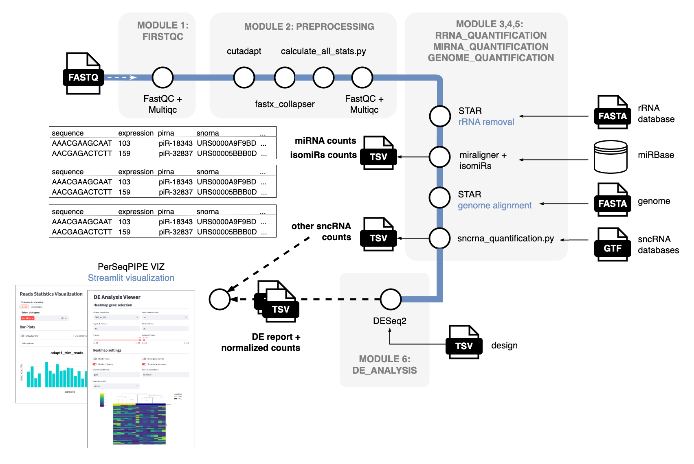

<picture>
    <source media="(prefers-color-scheme: dark)" srcset="docs/images/logo_dark.png">
    
</picture>

## ⭐ Introduction

**PerSeqPIPE** is a bioinformatics pipeline for analysis of small RNA-sequencing datasets with focus on quantification of various small non-coding RNAs using a sequence-centric approach. 

<picture>
    <source media="(prefers-color-scheme: dark)" srcset="docs/images/PerSeqPIPE.png">
    
</picture>

For detailed information about individual PerSeqPIPE modules, please refere to [Module description](docs/module_description.md) documentation. Annotation GTF file used for sncRNA quantification was create as described in [Annotation preparation](docs/annotation_preparation.md) using databases specified in [Reference databases](docs/reference_databases.md).

> [!IMPORTANT]
> In the context of the PerSeqPIPE workflow, the term **module** refers to a distinct analytical component implemented as a Nextflow *subworkflow* (for example, preprocessing or quality control). This usage differs from the Nextflow definition of a *module*, which typically denotes a smaller reusable wrapper around a single tool or script. We adopt the term **module** for clarity and readability when describing the major functional parts of the PerSeqPIPE workflow.

## 💻 Usage

For instructions on how to execute the PerSeqPIPE pipeline, please refer to [Usage](docs/usage.md) documentation.

## 🔍 Pipeline outputs

Outputs of PerSeqPIPE individual modules are desribed in [Outputs](docs/outputs.md) documentation.

A full size example test run results can be downloaded here. 

## 🎺 Credits

PerSeqPIPE pipeline is written and maintaned by Karolina Trachtova (karolina.trachtova@ceitec.muni.cz).

## ⁉️ Reporting issues

To report bugs or request additional features, please open a new [issue](https://github.com/ktrachtova/perseqpipe/issues). In case the problem is time-sensitive, you can also write directly to Karolina Trachtova (karolina.trachtova@ceitec.muni.cz) and we will try to adress the issue as fast as possible.

## 📎 Citations

An extensive list of references for the tools used by the pipeline can be found in the [`CITATIONS.md`](CITATIONS.md) file.
